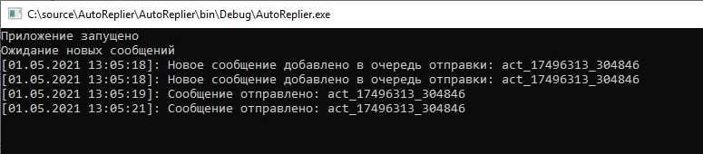

 ## AutoReplier

Назначение приложения является автоответ на сообщения вида:
```
<html>
    <head></head>
    <body>
        ...
        <a href=mailto:example@example.com?subject=test_12345678_123456
        Body=Соглacие>Гарантируем</a>
        <a href=mailto:example@example.com?subject=test_12345678_123456
        Body=Несоглаcие>Нет</a>
        ...
    </body>
</html>
```

На каждое новое полученное сообщения от определенного адреса, с указанным выше содержимым,
осуществляется автоответ, при котором получателем является адрес, заданный в конфигурации приложения,
а темой письма является атрибут `subject`. Иными словами, обеспечивается автоматизация процесса нажатия на ссылку и кнопки отправки письма.

Для работы приложения необходимо:
1. Заполнить файл appConfig.json необходимыми параметрами (описание параметров можно увидеть в файле appConfig.json).
Файл должен располагаться рядом с приложением.
2. Запустить приложение (с передаваемым аргументом `--password` или задав пароль от почтового ящика по требованию).

Скриншот работы приложения:

